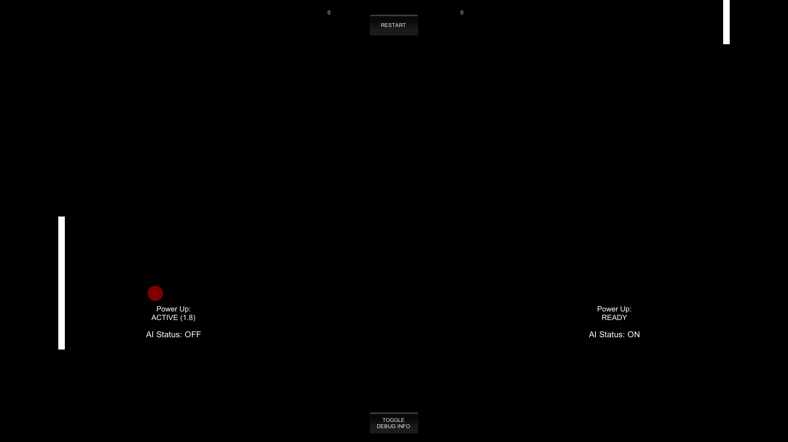

# Pong
Simple remake of the classic pong games using Unity. Can be played by 2 players, 1 player vs CPU, or just sit back, relax, and enjoy CPU vs CPU.

## Improvements
From the base tutorial I make some improvements which are:
- Refactor base code so that each script has single purpose responsibility (especially GameManager script)
- Implement my own dotted line system using line renderer to highly improve performance (from 10 fps to 60+ fps)
- Add UI elements to show player informations
- Add power up to expand the player for a specified amount of time and add cooldown each time the power up is activated
- Ball sometimes becomes fireball randomly within 10-30 seconds (configurable) each round and it is unblockable by player
- Implement simple artifical intelligence to play the game

## Screenshot

## Controls
### P1
- Move Up: W
- Move Down: S
- Power Up: E
- Activate AI: Q
### P2
- Move Up: Arrow Up
- Move Down: Arrow Down
- Power Up: Right Ctrl
- Activate AI: Right Shift

## Notes for Assistant / Examiner
If you want to checkout the basegame without all my improvements you can do so <a href=https://github.com/SteveImmanuel/pong-unity/tree/58f16001b739b7036fa158f542deef6b0d52f275>here</a>. All build results is located in the <a href=https://github.com/SteveImmanuel/pong-unity/releases>release</a> page.